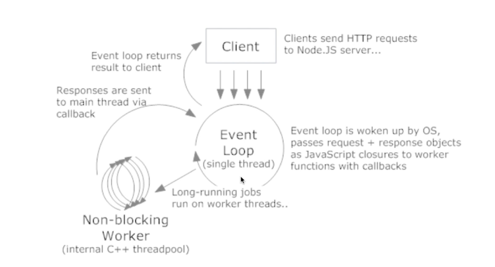

###为什么偏爱 NodeJs

- 前端职责范围变大，统一开发体验

- 在处理高并发、I/O 密集场景性能优势明显

###CPU密集 VS I/O 密集

- CPU 密集：压缩、解压、加密、解密

- I/O 密集：文件操作、网络操作、数据库

###web 常见场景

- 静态资源读取

- 操作库操作

- 渲染页面

###高并发应对之道

- 增加机器数

- 增加每台机器的 CPU 数 —— 多核

###进程

- 进程：是计算机中的程序关于某数据集合上的一次运行活动，是系统进行资源分配和调度的基本单位

- 多进程：启动多个进程，多个进程可以一块执行多个任务

###NodeJs 工作模型

###线程

- 线程：进程内一个相对独立的、可调度的执行单元，与同属一个进程的线程共享进程的资源

- 多线程：启动一个进程，在一个进程内启动多个线程，这样多个线程也可以一块执行多个任务

###NodeJs 的单线程

- 单线程只是针对主进程，I/O 操作系统底层多线程调度

- 单线程并不是单进程

###常用场景

- Web Server

- 本地代码构建

- 使用工具开发
